# Laporan Praktikum #10 - Pengantar Konsep PBO

## Kompetensi

Setelah melakukan percobaan pada jobsheet ini, diharapkan mahasiswa
mampu:
a. Memahami konsep dan bentuk dasar polimorfisme
b. Memahami konsep virtual method invication
c. Menerapkan polimorfisme pada pembuatan heterogeneous collection
d. Menerapkan polimorfisme pada parameter/argument method
e. Menerapkan object casting untuk meng-ubah bentuk objek

## Ringkasan Materi
    
Polimorfisme merupakan kemampuan suatu objek untuk memiliki banyak bentuk. Penggunaan polimorfisme yang paling umum dalam OOP terjadi ketika ada referensi super class yang digunakan untuk merujuk ke objek dari sub class. 

## Percobaan

### Percobaan 1
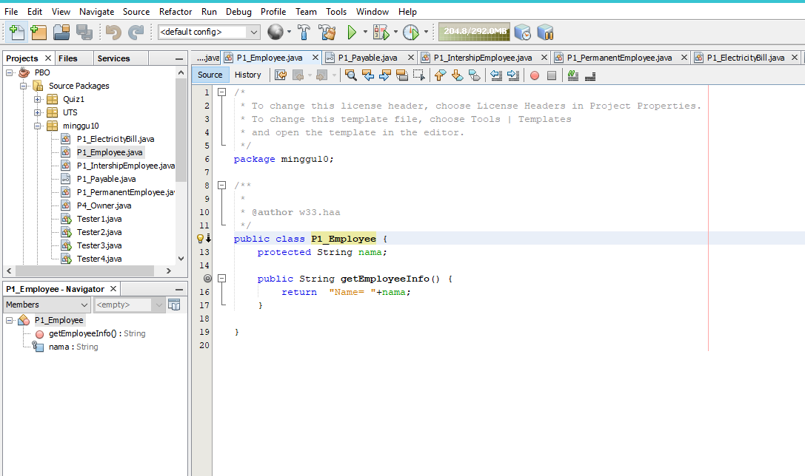

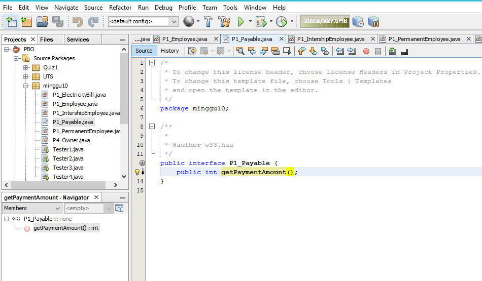
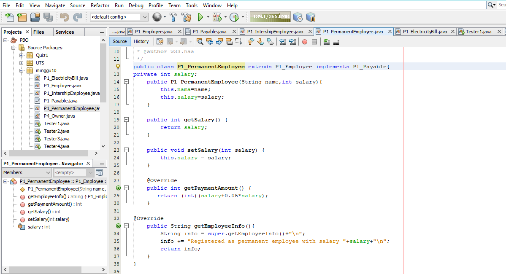
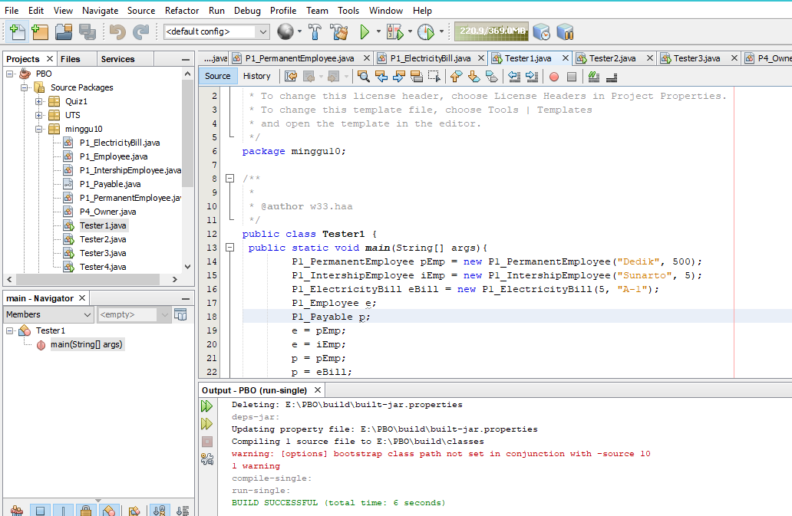

link kode program : [Program 1](../../Src/10_Polimorfisme/P1_Employee.java)

link kode program : [Program 2](../../Src/10_Polimorfisme/P1_IntershipEmployee.java)

link kode program : [Program 3](../../Src/10_Polimorfisme/P1_Payable.java)

link kode program : [Program 4](../../Src/10_Polimorfisme/P1_PermanentEmployee.java)

link kode program : [Program 5](../../Src/10_Polimorfisme/P1_Tester1.java)

### Pertanyaan - Percobaan 1 : 
1.
   Jawab : Class IntershipEmployee dan Class PermanentEmployee.

2. 
   Jawab : Class PermanentEmployee dan ElectricityBill.

3. 
   Jawab : Karena merupakan turunan dari class Employee dimana class Employee diinstasiasi dengan objek e.

4. 
   Jawab : Karena class PermanentEmployee & ElectricityBill mengimplentasikan interface dari class Payable.
5. 
   Jawab : Karena Class PermanentEmployee dan InternshipEmployee adalah turunan dari Class Payable.

6. 
   Jawab : Polimorfisme bisa diterapkan pada class-class yang memiliki relasi inheritance dan interface. Ketika ada objek yang dideklarasikan dari suatu interface, maka ia bisa digunakan untuk mereferensikan ke objek yang mengimplements class interface tersebut.

### Percobaan 2
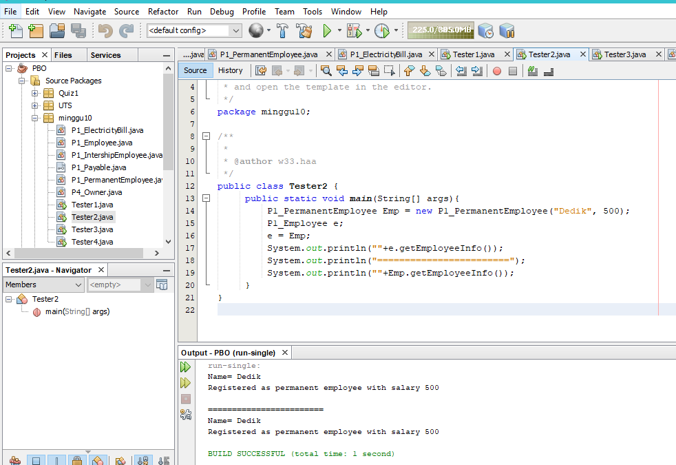

link kode program : [Program 1](../../Src/10_Polimorfisme/Tester2.java)
### Pertanyaan - Percobaan 2 : 
1.
   Jawab : Karena sudah dideklarasikan bahwa object e merupakan pEmp.

1. 
   Jawab : karena e adalah method yang berfungsi untuk passing.

2. 
   Jawab : Virtual method invocation terjadi ketika ada pemanggilan overriding method dari suatu object polimorfisme. Karena antara method yang dikenali oleh compiler dan method yang dijalankan oleh JVM berbeda.

### Percobaan 3
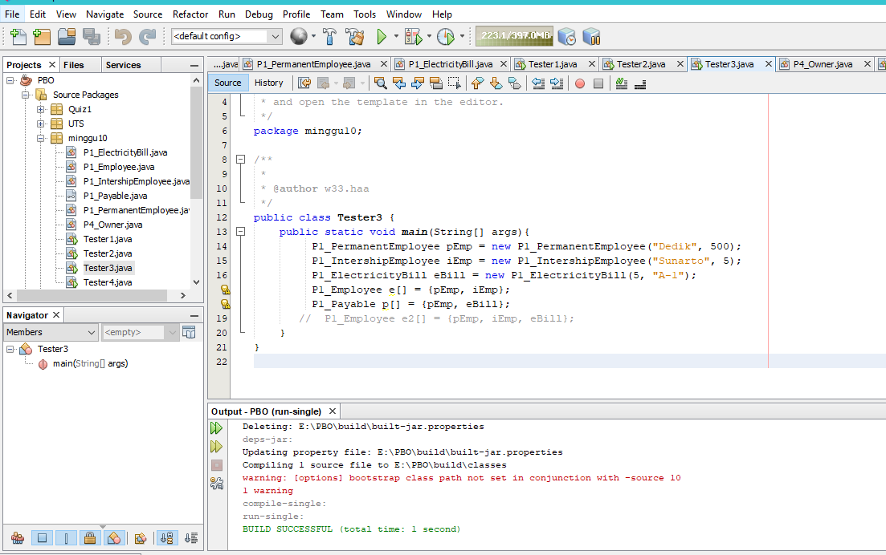

link kode program : [Program 1](../../Src/10_Polimorfisme/Tester3.java)

### Pertanyaan - Percobaan 3 : 
1. 
   Jawab : karena objek pEmp dan iEmp adalah object dari class yang merupakan turunan dari class Employee.

2. 
   Jawab : Karena objek pEmp dan eBill merupakan object dari class yang mengimplements dari class Payable.

3. 
   Jawab : Karena eBill bukan termasuk Class turunan dari Class Employee.

### Percobaan 4
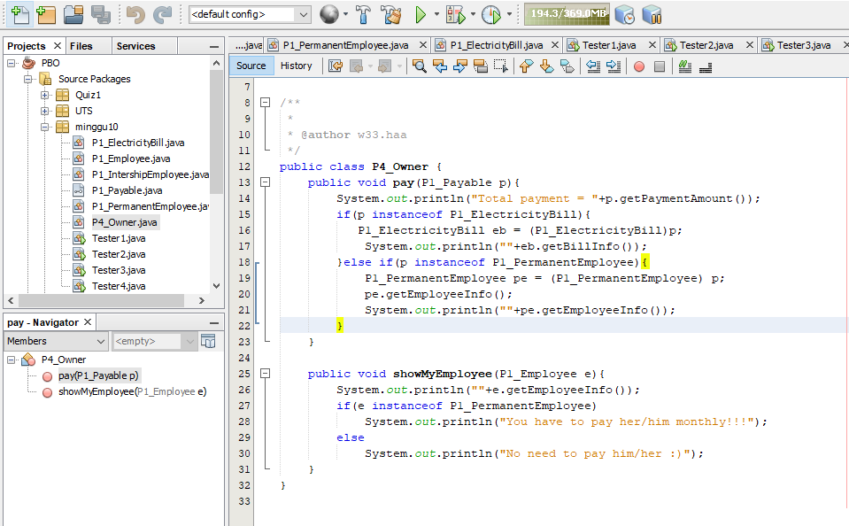

link kode program : [Program 1](../../Src/10_Polimorfisme/P4_Owner.java)

link kode program : [Program 2](../../Src/10_Polimorfisme/Tester4.java)

### Pertanyaan - Percobaan 4 : 
1. 
   Jawab : Pada class Tester4 baris ke-7 dan baris ke-11, pemanggilan ow.pay(eBill) dan ow.pay(pEmp) bisa dilakukan, padahal jika diperhatikan method pay() yang ada di dalam class Owner memiliki argument/parameter bertipe Payable karena keduanya sama - sama mengimplementasikan interface Payable.

2. 
   Jawab : Tujuan membuat argument bertipe Payable pada method pay() yang ada di dalam class Owner untuk bisa memanggil           method getPaymentAmount yang ada di masing – masing object yang dimasukkan sebagai parameter.

3. 
   Jawab : Eror karena iEmp tidak mengimplements class Payable.

4. 
   Jawab : Untuk mengecek apakah object yang dimasukkan sebagai implements dari Payable atau tidak.

5. 
   Jawab : Untuk dikembalikan ke instan sesungguhnya sehingga dapat memanggil method getBillInfo() yang hanya ada di              class ElectricityBill.

## TUGAS
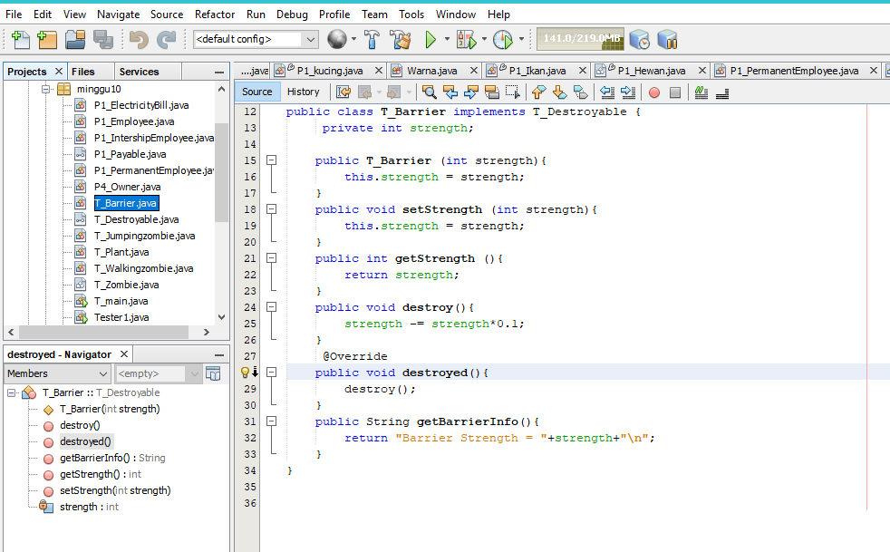

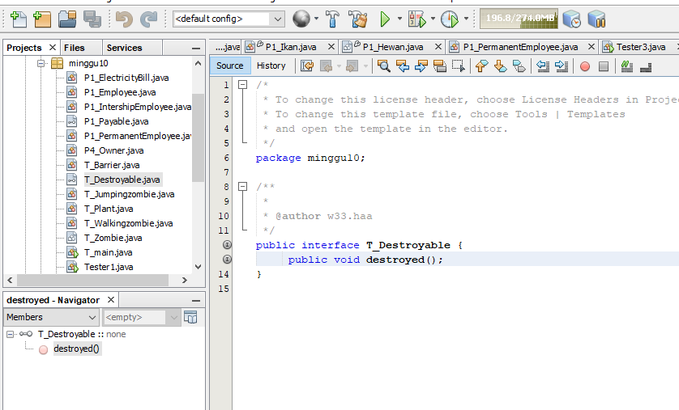

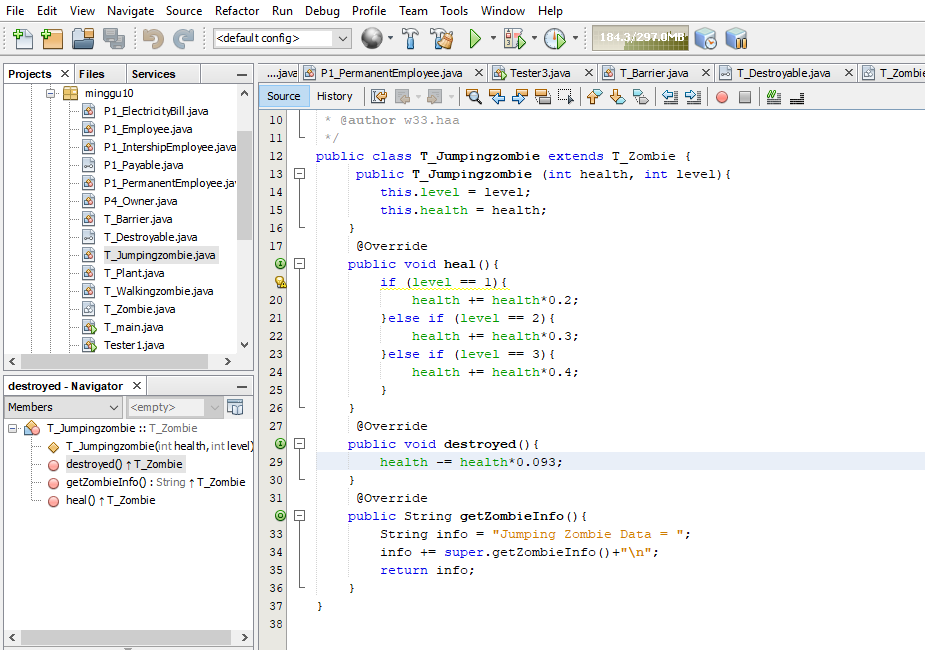

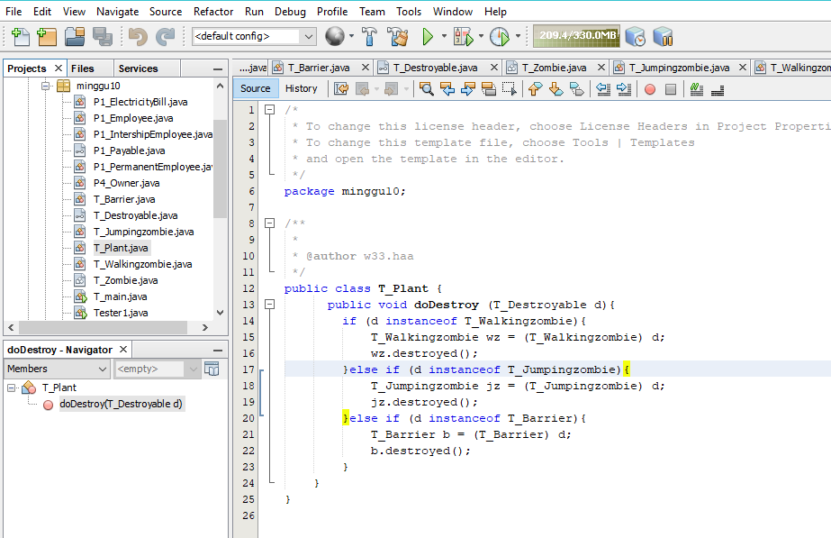

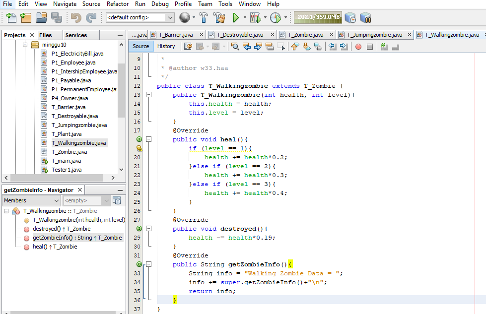

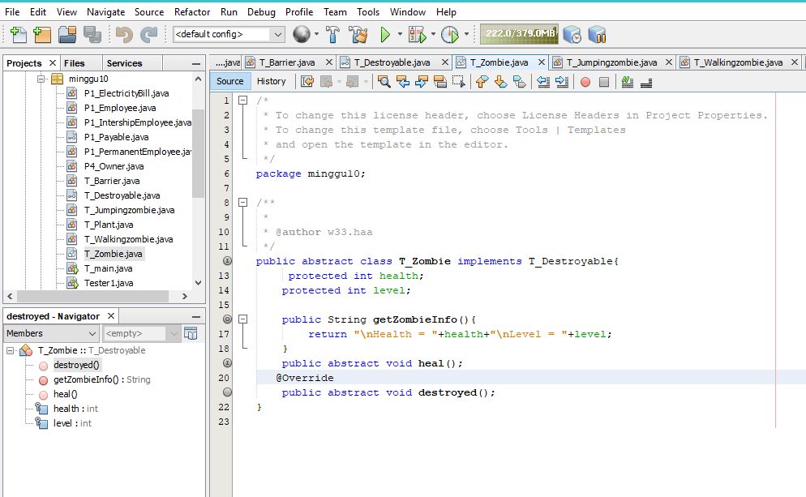

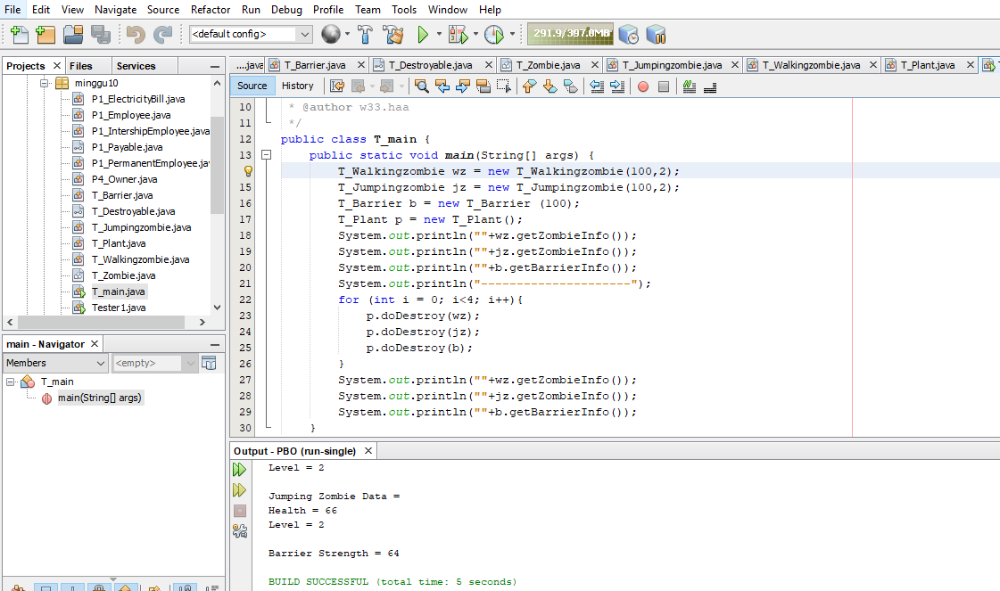

link kode program : [Program 1](../../Src/10_Polimorfisme/T_Barrier.java)

link kode program : [Program 2](../../Src/10_Polimorfisme/T_Destroyable.java)

link kode program : [Program 3](../../Src/10_Polimorfisme/T_Jumpingzombie.java)

link kode program : [Program 4](../../Src/10_Polimorfisme/T_Plant.java)

link kode program : [Program 5](../../Src/10_Polimorfisme/T_Walkingzombie.java)

link kode program : [Program 6](../../Src/10_Polimorfisme/T_Zombie.java)

link kode program : [Program 7](../../Src/10_Polimorfisme/T_main.java)

## Kesimpulan
Polimorfisme merupakan siaft objek yang bisa memiliki banyak bentuk dan fungsi. 

## Pernyataan Diri

Saya menyatakan isi tugas, kode program, dan laporan praktikum ini dibuat oleh saya sendiri. Saya tidak melakukan plagiasi, kecurangan, menyalin/menggandakan milik orang lain.

Jika saya melakukan plagiasi, kecurangan, atau melanggar hak kekayaan intelektual, saya siap untuk mendapat sanksi atau hukuman sesuai peraturan perundang-undangan yang berlaku.

Ttd,

***MOchamad Fariz I***