# Laporan Praktikum #11 - Pengantar Konsep PBO

## Kompetensi

1. Membuat aplikasi Graphical User Interface sederhana dengan bahasa pemrograman java;
2.  Mengenal komponen GUI seperti frame, label, textfield, combobox, radiobutton, checkbox, textarea, menu, serta table;
3.   Menambahkan event handling pada aplikasi GUI.
## Ringkasan Materi
   Java Swing merupakan bagian dari JFC (Java Foundation Classes) yang menyediakan API untuk menangani hal yang berkaitan dengan GUI bagi program Java.  Kita bisa membedakan komponen Swing dengan komponen AWT, di mana pada umumnya kelas-kelas yang berada dalam komponen Swing diawali dengan huruf J, misal: JButton, JLabel, JTextField, JRadioButton. 
 
## Percobaan

### Percobaan 1
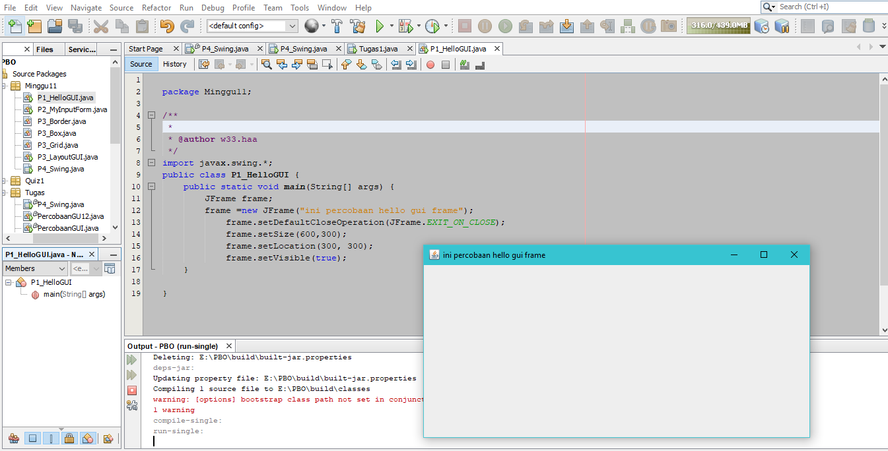

link kode program : [Program 1](../../Src/11_GUI/P1_HelloGUI.java)

### Percobaan 2
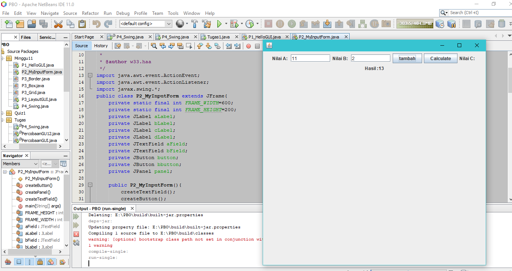

link kode program : [Program 1](../../Src/11_GUI/P2_MyInputForm.java)
### Pertanyaan - Percobaan 2 : 
1.
   Jawab : sudah saya cantumkan di percobaan 2
   ### Percobaan 3
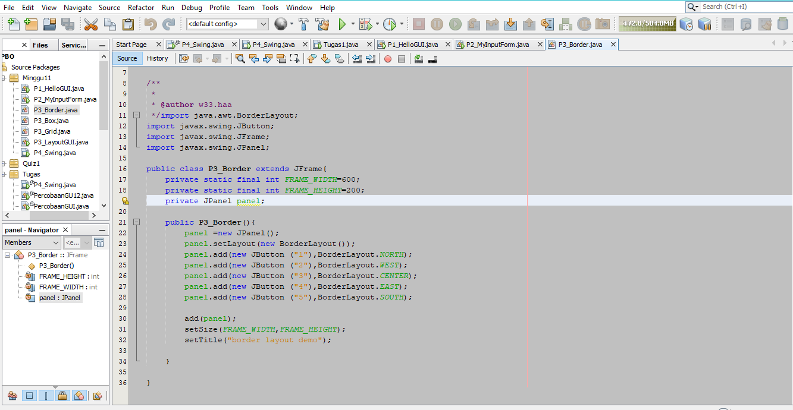

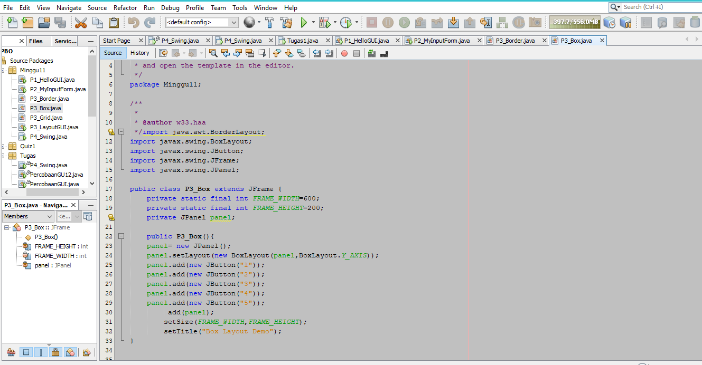

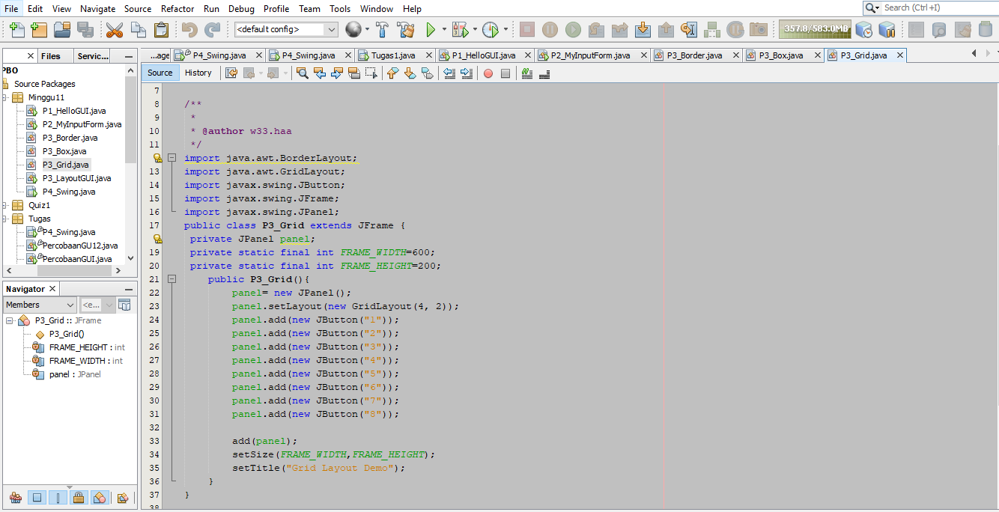

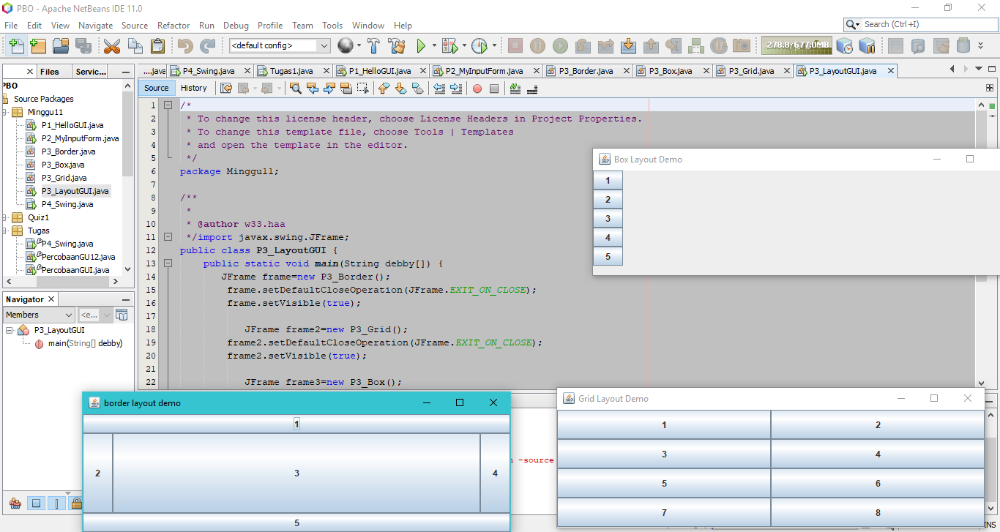

link kode program : [Program 1](../../Src/11_GUI/P3_Border.java)

link kode program : [Program 2](../../Src/11_GUI/P3_Box.java)

link kode program : [Program 3](../../Src/11_GUI/P3_Grid.java)

link kode program : [Program 4](../../Src/11_GUI/P3_LayoutGUI.java)

### Pertanyaan - Percobaan 3 : 
1. 
   Jawab : Perberbedaan pada Grid box dan border adlah penempatan label    

2. 
   Jawab :Untuk menampilkan frmae/tampilan pada label

### Percobaan 4
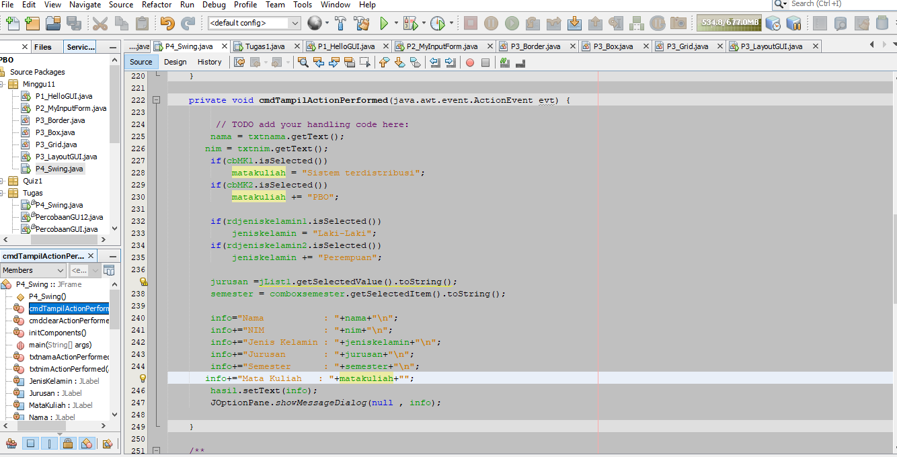

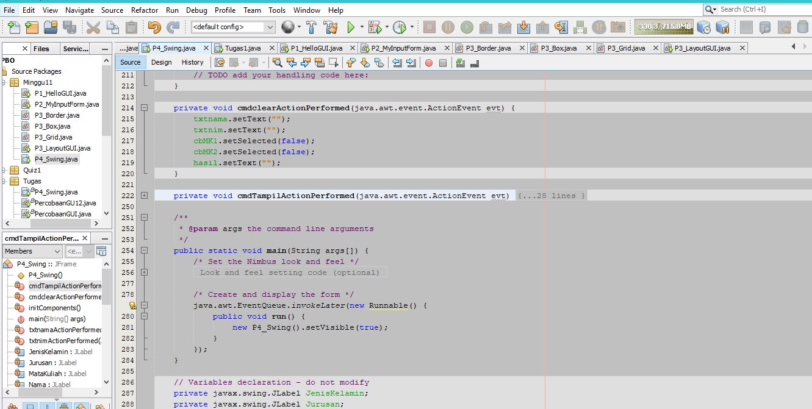

link kode program : [Program 1](../../Src/11_GUI/P4_Swing.java)

### Pertanyaan - Percobaan 4 : 
1. 
   Jawab :Untuk melakukan eksekusi dessain yg telah di buat

2. 
   Jawab : karena untuk bisa memilih salah satu yang diselect
3. 
   
### Percobaan 5
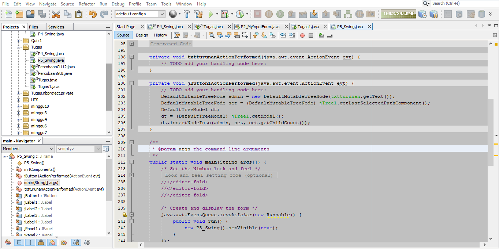

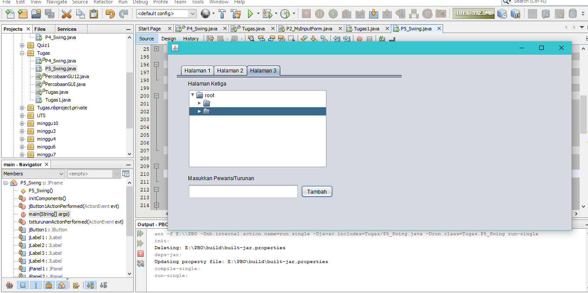

link kode program : [Program 1](../../Src/11_GUI/P5_Swing.java)

## TUGAS
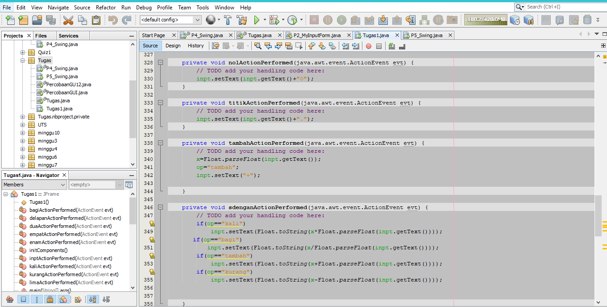

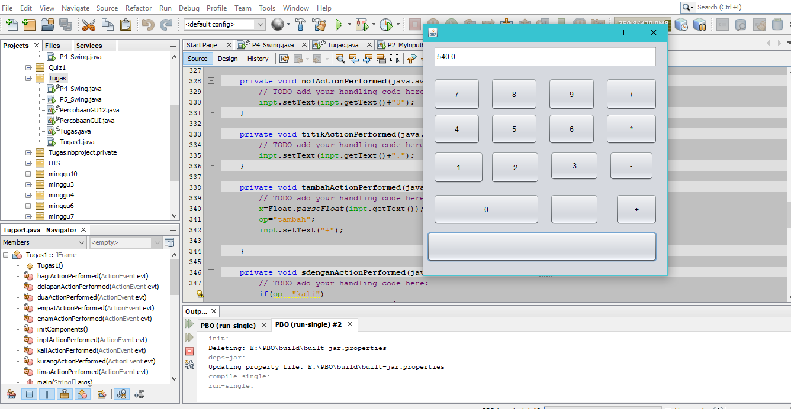

link kode program : [Program 1](../../Src/11_GUI/Tugas1.java)
### Pertanayaan5
1. JTabPane adalah panel yang memiliki tab & bisa beralih dari tab 1 ke tab lainnya 
2. JTree adalah sebuah direktori folder yang tersusun seperti pohon ketika memiliki folder didalam folder 

### Penemuan saat Pratkium
agak sedikit bingung karena baru pertama kali

pada percobaan ke 3 ada code public static void main(String debby[]) berbeda dengan args ternyata hanya penamaan variable array untuk mentimpan argument dari semua method yang ada pada suatu class

## Kesimpulan
GUI adalah seperangkat aplikasi yang menampilkan semua menu, ikon dan alat penunjuk lainnya yang menggantikan perintah ketik di shell. Hal ini membuat pengguna komputer menjadi lebih mudah mengoperasikan sebuah perangkat daripada mengingat perintah yang menggunakan teks pada sebuah kotak komando tertentu.
## Pernyataan Diri

Saya menyatakan isi tugas, kode program, dan laporan praktikum ini dibuat oleh saya sendiri. Saya tidak melakukan plagiasi, kecurangan, menyalin/menggandakan milik orang lain.

Jika saya melakukan plagiasi, kecurangan, atau melanggar hak kekayaan intelektual, saya siap untuk mendapat sanksi atau hukuman sesuai peraturan perundang-undangan yang berlaku.

Ttd,

***MOchamad Fariz I***