# Laporan Praktikum #12 - JAVA API

## Kompetensi
1. Memahami cara penyimpanan objek menggunakan Collection dan Map. 
2.  Mengetahui pengelompokan dari Collection. 
3.  Mengetahui perbedaan dari interface Set, List dan Map. 
4.  Mengetahui penggunaan class-class dari interface Set, List, dan Map. 
5.  Memahami koneksi database menggunakan JDBC dan JDBC AP
## Ringkasan Materi
   Collection adalah suatu objek yang bisa digunakan untuk menyimpan sekumpulan objek. Objek yang ada dalam Collection disebut elemen. Collection menyimpan elemen yang bertipe Object, sehingga berbagai tipe object bisa disimpan dalam Collection. Class-class mengenai Collection tergabung dalam Java Collection Framework. Class-class Collection diletakkan dalam package java.util dan mempunyai dua interface utama yaitu Collection. 
 
## Percobaan

### Percobaan 1
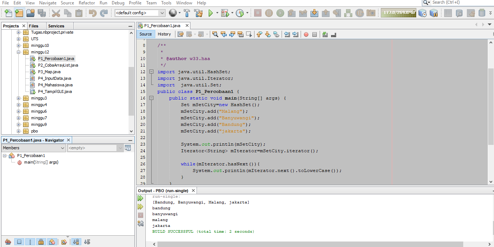

link kode program : [Program 1](../../Src/12_Java_API/P1_Percobaan1.java)

### Pertanyaan Percobaan1
1.  Untuk mengimpor semua kelas di dalam java. 
 
2.  Pada baris ke-18. 
 
3.  Untuk menambahkan objek kedalam HashSet() 
 
4. Karena nama objek yang seharusnya adalah mSetCity. Jika mengunakan set maka program tidak mengenali objek tersebut. 
 
5. Iterator digunakan untuk mengakses dan menampilkan nilai beserta tambahan ethod lalin yang didefinisikan di dalam interface Iterator. 

### Percobaan 2
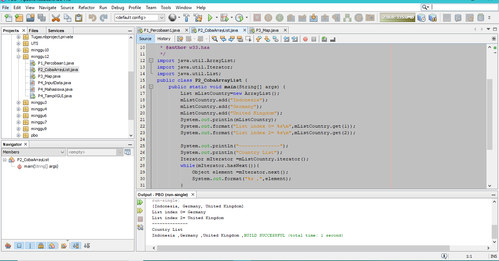

link kode program : [Program 1](../../Src/12_Java_API/P2_CobaArrayList.java)
### Pertanyaan - Percobaan 2 : 
1. Untuk menampilkan nilai dari mListCountry dan menampilkan data mListCountry index ke 0 dan index ke 
 
2. sudah saya cantumkan di pratikum
 
 
3.  Ketika menggunakan potongan program no 1 maka menampilkan data menggunakan list, sedangkan pada potongan program no 2 menampilkan semua data dengan iterator
  
   ### Percobaan 3
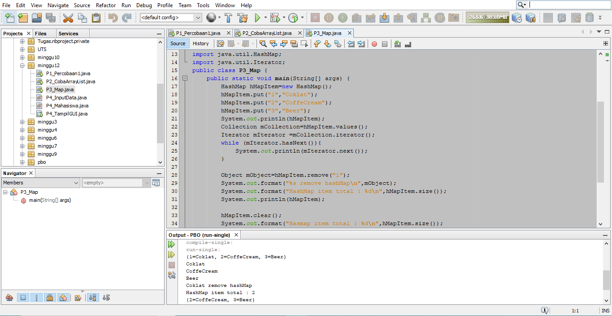

!

link kode program : [Program 1](../../Src/12_Java_API/P3_Map.java)

### Pertanyaan - Percobaan 3 : 
1. Untuk menambahkan object dengan key 1 dengan nama biscuit ke dalam object hMapItem pada HashMap(). 
 
2.  Untuk menampilkan size atau banyak data dari hMapItem. 
 
3.  Untuk menghapus item dengan key 1. 
 
4.  Untuk menghapus semua data yang ada pada hMapItem. 
 
5. sudah saya cantumkan di pratikum
6.  sudah saya cantumkan di pratikum
 
7. Setelah ditambahkan kode program tersebut adalah adanya penampilan data menggunakan iterator

### Percobaan 4
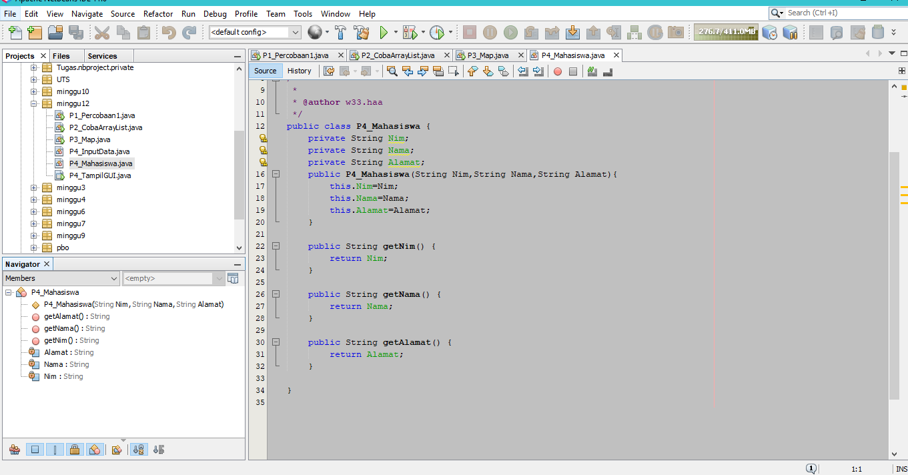

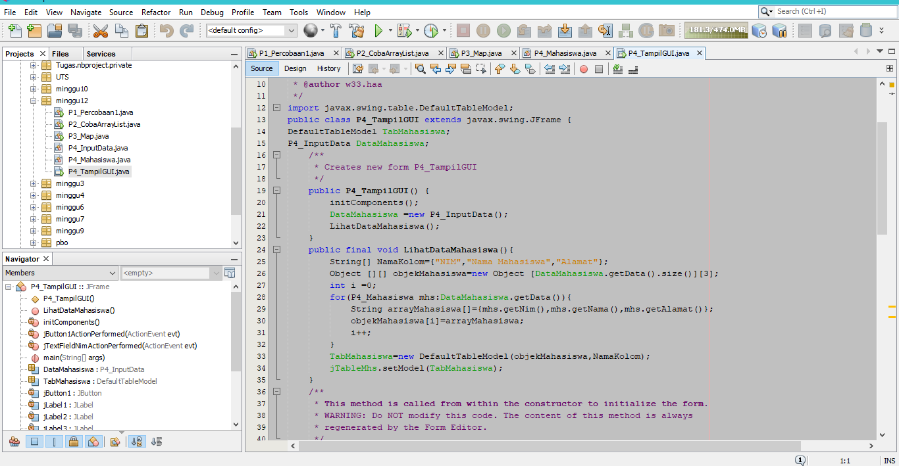

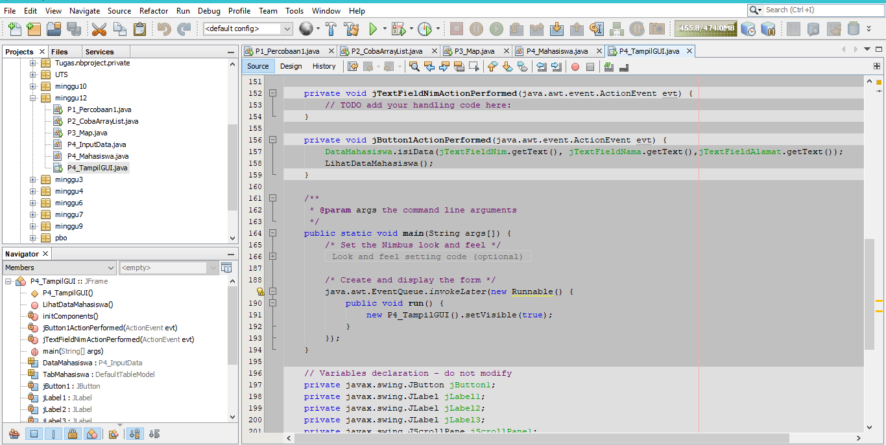

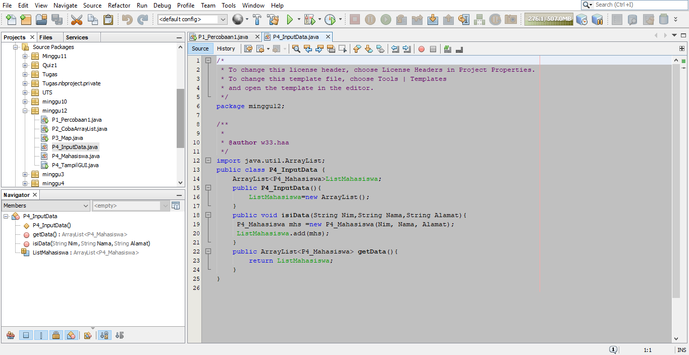

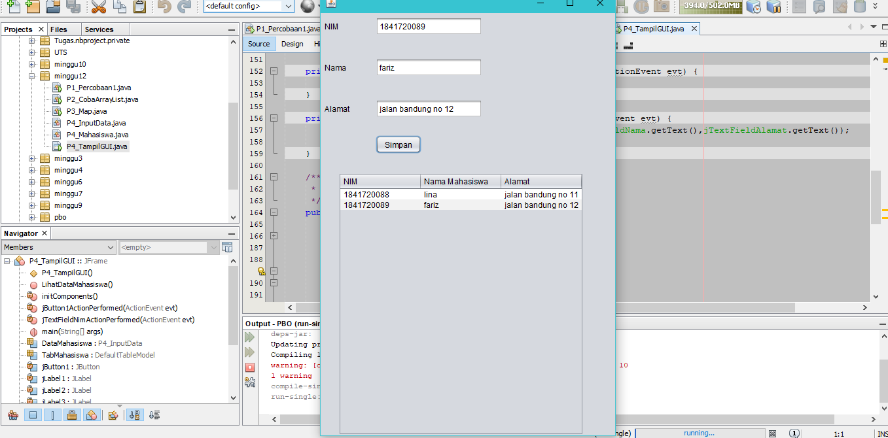

link kode program : [Program 1](../../Src/12_Java_API/P4_InputData.java) 

link kode program : [Program 2](../../Src/12_Java_API/P4_Mahasiswa.java) 

link kode program : [Program 3](../../Src/12_Java_API/P4_TampilGUI.form) 

link kode program : [Program 4](../../Src/12_Java_API/P4_TampilGUI.java) 

   
### Percobaan 5
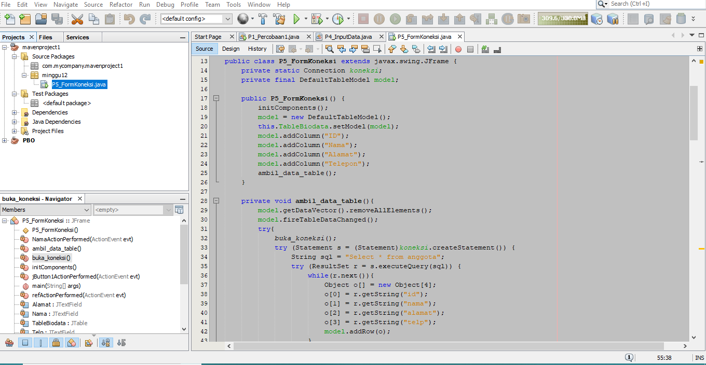

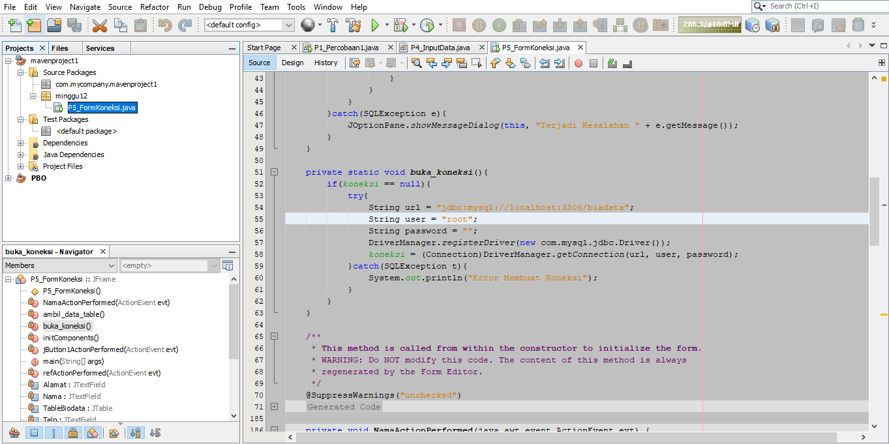

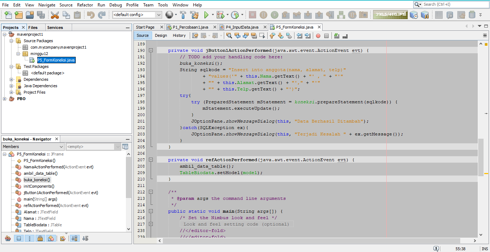

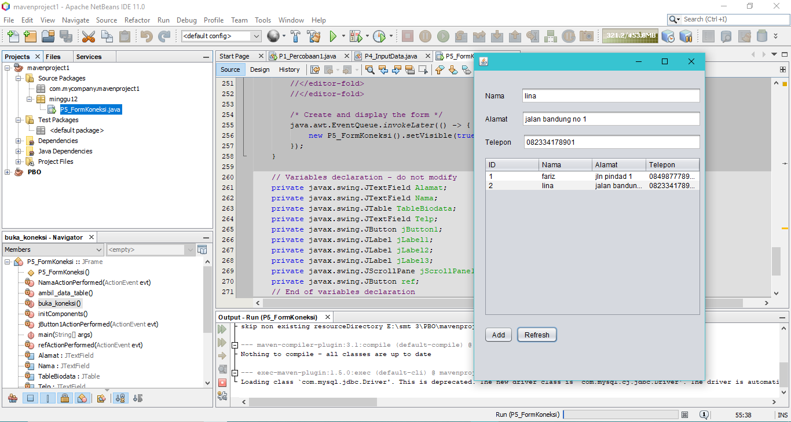

link kode program : [Program 1](../../Src/12_Java_API/P5_FormKoneksi.form))

link kode program : [Program 2](../../Src/12_Java_API/P5_FormKoneksi.java) 

## Kesimpulan
Java API is a set of libraries that are found in the standard Java distribution, and is called the JRE (Java Runtime). So, every time you use something like Integer as a class for representing integers, you're using Java's API.
## Pernyataan Diri

Saya menyatakan isi tugas, kode program, dan laporan praktikum ini dibuat oleh saya sendiri. Saya tidak melakukan plagiasi, kecurangan, menyalin/menggandakan milik orang lain.

Jika saya melakukan plagiasi, kecurangan, atau melanggar hak kekayaan intelektual, saya siap untuk mendapat sanksi atau hukuman sesuai peraturan perundang-undangan yang berlaku.

Ttd,

***MOchamad Fariz I***