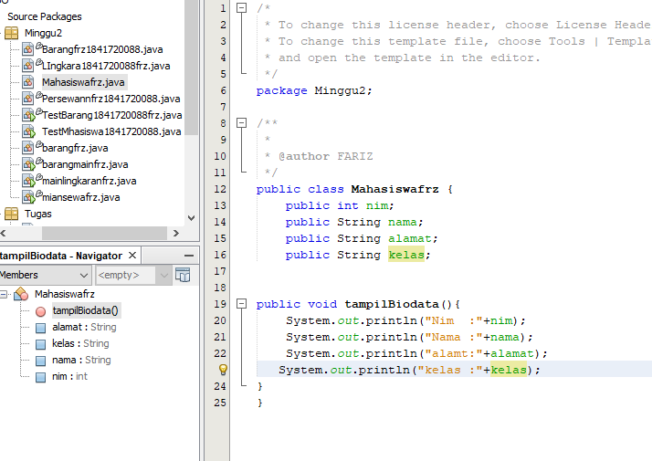
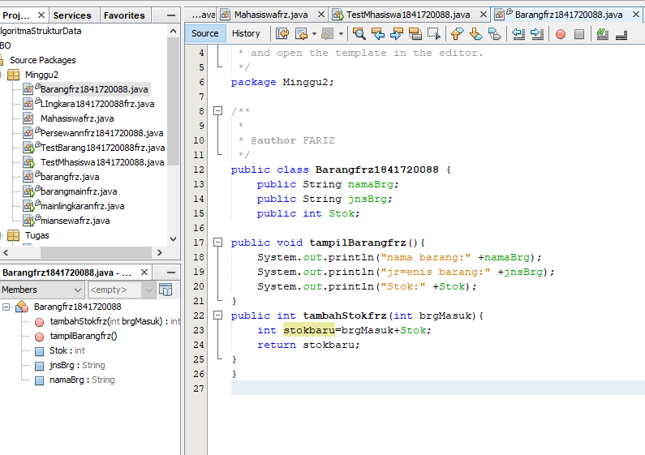
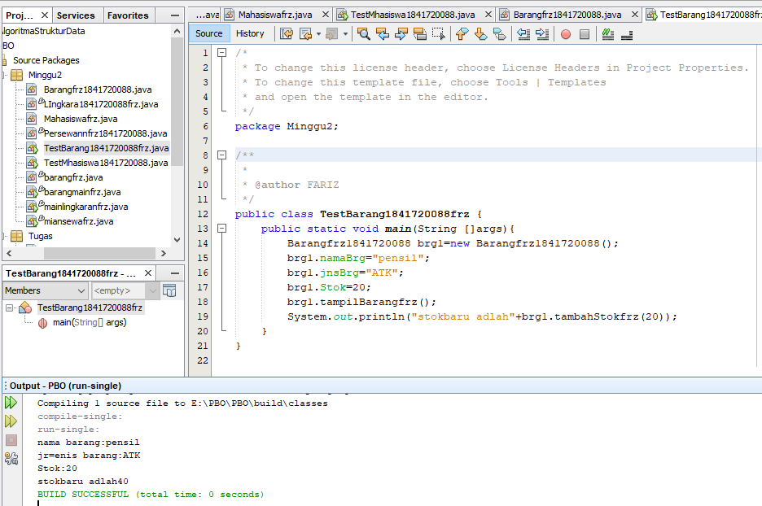
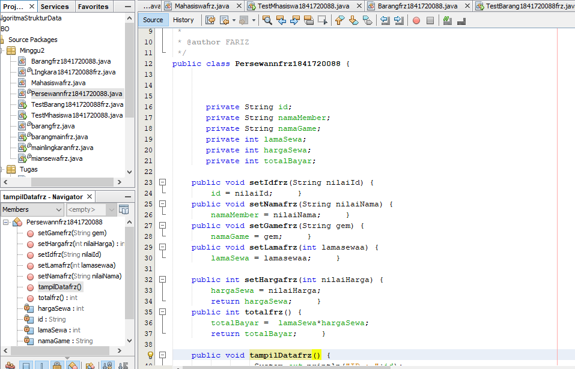
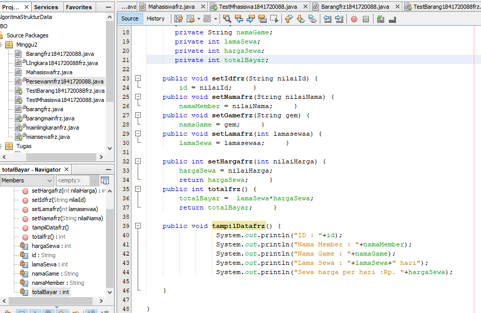
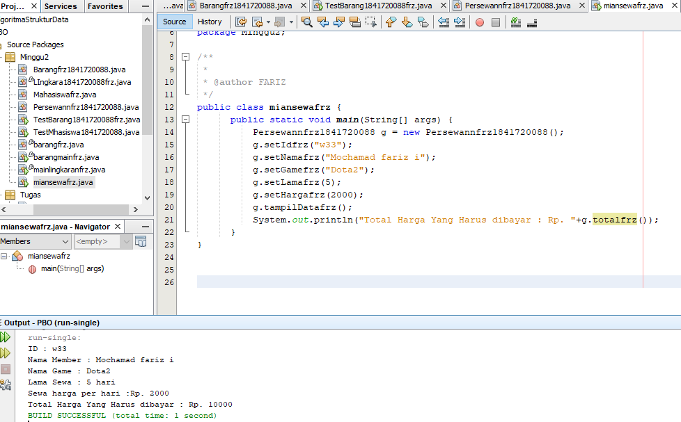
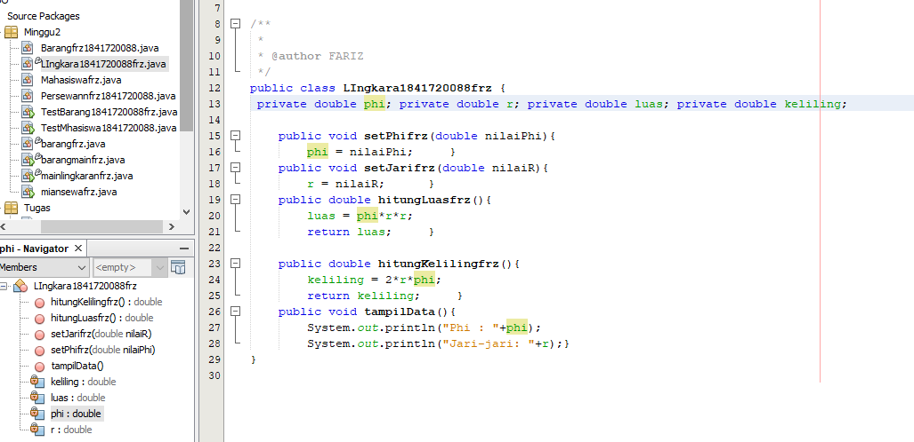
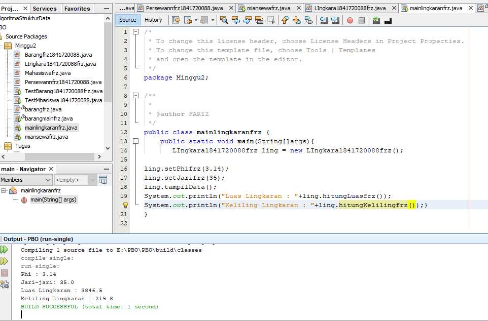
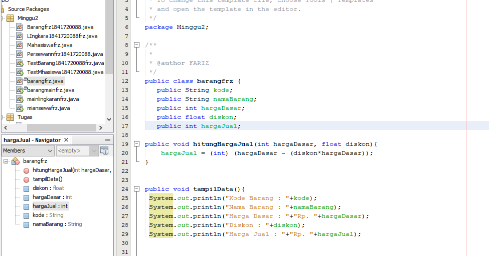
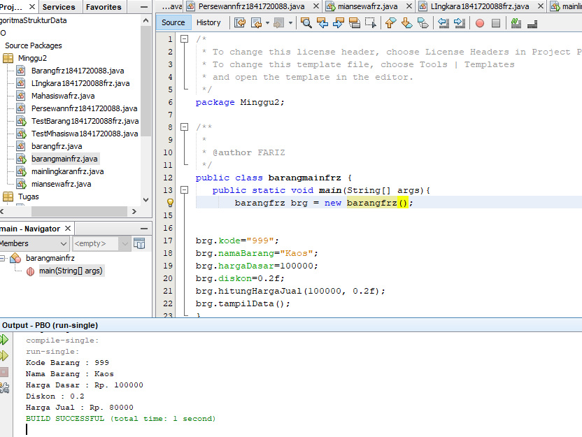

# Laporan Praktikum #2 - CLASS DAN OBJEC

## Kompetensi

Mahasiswa dapat memahami deskripsi dari class dan object 
 Mahasiswa memahami implementasi dari class git
 Mahasiswa dapat memahami implementasi dari attribute 
 Mahasiswa dapat memahami implementasi dari method 
 Mahasiswa dapat memahami implementasi dari proses instansiasi
 Mahasiswa dapat memahami implementasi dari try-catch 
 Mahasiswa dapat memahami proses pemodelan class diagram menggunakan UML 

 kelas TI-2C

## Ringkasan Materi

(memahami opbjek darisuatu class)

## Percobaan

### Percobaan 1

(berisi penjelasan percobaan 1. Jika ada rujukan ke file program, bisa dibuat linknya di sini.)

`contoh screenshot yang benar, menampilkan 3 komponen, yaitu struktur project, kode program, dan hasil kompilasi`

 link kode program : [kode progam untuk pratikum 1](../../src/2_Class_dan_Object/Mahasiswafrz.java)

 link kode program : [kode progam untuk pratikum 1](../../src/2_Class_dan_Object/TestMhasiswa1841720088.java)

### Percobaan 2

(berisi penjelasan percobaan 2. Jika ada rujukan ke file program, bisa dibuat linknya di sini.)

`contoh screenshot yang benar, menampilkan 3 komponen, yaitu struktur project, kode program, dan hasil kompilasi`

 link kode program : [pratikum barang](../../src/2_Class_dan_Object/Barangfrz1841720088.java)

 link kode program : [barang main](../../src/2_Class_dan_Object/TestBarang1841720088frz.java)

## Pertanyaan

(tidak ada pertanyaan)

## Tugas

`Tugas 1`

`Tugas 2`

 link kode program : [tugas 2 persewaan](../../src/2_Class_dan_Object/Persewannfrz1841720088.java)

link kode program : [persewaan main](../../src/2_Class_dan_Object/miansewafrz.java)

`Tugas 3`

 link kode program : [linkaran](../../src/2_Class_dan_Object/LIngkara1841720088frz.java)

 link kode program : [linkaran main](../../src/2_Class_dan_Object/mainlingkaranfrz.java)

`Tugas 4`

 link kode program : [Barang](../../src/2_Class_dan_Object/barangfrz.java)

 link kode program : [ini contoh link ke kode program](../../src/2_Class_dan_Object/barangmainfrz.java)

## Kesimpulan

(Objek bisa di akses oleh class lain)

## Pernyataan Diri

Saya menyatakan isi tugas, kode program, dan laporan praktikum ini dibuat oleh saya sendiri. Saya tidak melakukan plagiasi, kecurangan, menyalin/menggandakan milik orang lain.

Jika saya melakukan plagiasi, kecurangan, atau melanggar hak kekayaan intelektual, saya siap untuk mendapat sanksi atau hukuman sesuai peraturan perundang-undangan yang berlaku.

Ttd,

***(MOCHAMAD FARIZ I)***