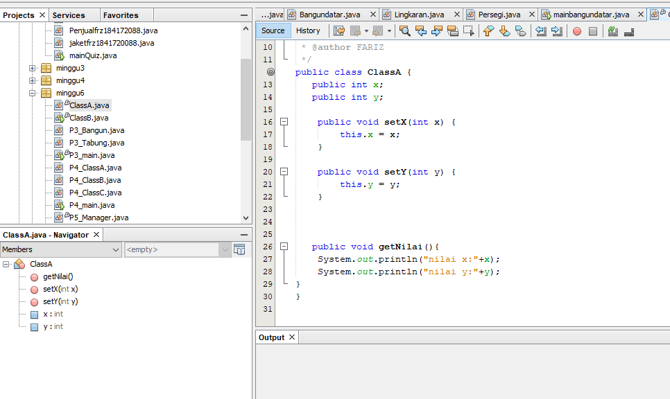
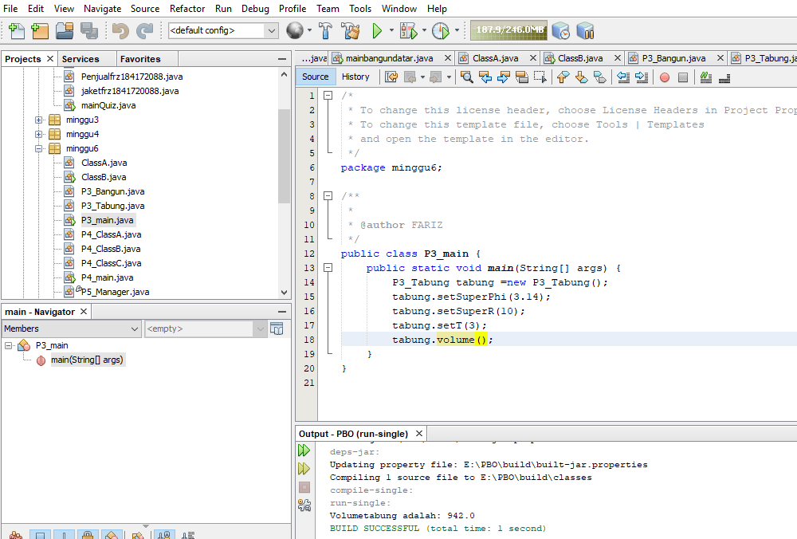

# Laporan Praktikum #6-INHERITANCE
## Kompetensi
Setelah menempuh pokok bahasan ini, mahasiswa mampu: 
1. Memahami konsep dasar inheritance atau pewarisan
2.  Mampu	 membuat	suatu	subclass	dari	suatu	
superclass tertentu.	
3. Mampu membuat objek dari suatu subclass dan melakukan akses dan method dari sendiri atau turunan

## Ringkasan Materi

untuk keseluruhan dalam menyelesaikan tugas yang di berikan dosen tidak ada masalah, mulai terbiasa dengan cara pengiriman 

## Percobaan

### Percobaan 1 EXTENDS

link kode program : [Program 1](../../Src/6_Inheritance/ClassA.java)

link kode program : [Program 2](../../Src/6_Inheritance/ClassB.java)

### Pertanyaan 

  Jawaban Pertanyaan Percobaan1

1. Terjadi error karena pada class B tidak ada kata kunci extends untuk mewarisi sifat dari class A
2. Karena atribut yang diakses dari kelas A tidak diwariskan ke kelas B dan tidak ada kata extends

### Percobaan 2 Hak Akses

link kode program : [Program 1](../../Src/6_Inheritance/ClassA.java)

link kode program : [Program 2](../../Src/6_Inheritance/ClassB.java)

  Jawab
1. public class ClassB extends ClassA{
    
    public int z;

    public void setZ(int z) {
        
        this.z = z;
    }

    
    public void getZ() {
        System.out.println("nilai z:"+z);
    }
   
    public void getJumlah(){
        System.out.println("jumlah:"+(x+y+z));
    }
2. TIDAK ADA KATA EXTENDS

### Percobaan 3 Super

link kode program : [Program 1](../../Src/6_Inheritance/P3_Bangun.java)

link kode program : [Program 2](../../Src/6_Inheritance/P3_Tabung.java)

link kode program : [Program 3](../../Src/6_Inheritance/P3_main.java)

### Pertanyaan

 
Jawab

1. Fungsi kata super menunjukkan akses ke class parent
2. Fungsi this merujuk pada referensi pada class itu sendiri jika ada atribut/variable yang penamaannya sama sedangkan kata super merujuk pada referensi class parent untuk mengakses method atau atribut
3. Karena pada class Tabung megakses atribut dari class Bangun

### Percobaan 4 Super construktor

link kode program : [Program 1](../../Src/6_Inheritance/P4_ClassA.java)

link kode program : [Program 2](../../Src/6_Inheritance/P4_ClassB.java)

link kode program : [Program 3](../../Src/6_Inheritance/P4_ClassC.java)

link kode program : [Program 4](../../Src/6_Inheritance/P4_main.java)

### Pertanyaan

Jawab

1. Supernya adalah class A karena clas b extends ke class a dan class c extends ke class b

2. urutan proses jalannya construktor pertana kata super mengidentifikasi pengaksesan method dari class parent kemudian ditampilkan di class yang mengakses

3. Fungsi kata super menunjukkan akses ke class parent

  

## Percobaan 5 
 

  
  
  
  
 
link kode program : [Program 1](../../Src/6_Inheritance/P5_karyawan.java)

link kode program : [Program 2](../../Src/6_Inheritance/P5_Manager.java)

link kode program : [Program 3](../../Src/6_Inheritance/P5_Staff.java)

link kode program : [Program 4](../../Src/6_Inheritance/P5_main.java)

### Pertanyaan

Jawab

1.  Super Class (Karyawan) sedangkan sub Class (Staff, Manager) dengan mengetikkan extends pada classnya dan di ikut i super classnya Karyawan 
2. Yaitu dengan menggunakan Extends untuk menurunkan ke Class yang lainnya
3. Pada ClassManager terdapat attribut : int Tunjagan 
2 Attribut pada class Kariyawan : Gaji , yang mana nanti akan di turunkan menjadi Tunjagan pada Class Manage
4. Mewakili dari kelas induknya yaitu Gaji , sedangkan tunjagan mewakili kelas Manage
5. Multilevel Inheritance: Suatu sub class yang menjadi parent class untuk class lainnya.

## Percobaan 6

link kode program : [Program 1](../../Src/6_Inheritance/P6_karyawan.java)

link kode program : [Program 2](../../Src/6_Inheritance/P6_Manager.java)

link kode program : [Program 3](../../Src/6_Inheritance/P6_Staff.java)

link kode program : [Program 4](../../Src/6_Inheritance/P6_StaffHarian.java)

link kode program : [Program 5](../../Src/6_Inheritance/P6_StaffTetap.java)

link kode program : [Program 6](../../Src/6_Inheritance/P6_main.java)
 

 ### Pertanyaan

Jawab

1.  Single Inheritance : Pada Percobaan 1 ClassA (Class B mewakili Class B , Class Tabung mewakili Class Tabung) Multilavel inheritance : pada Percobaan4 (Class B,C mewakili Class A, Class Manager, Staff mewakili Class Karyawan, Staffharian, Stafftetap mewakili Class Staff) 
2. Attribut Class StaffHarian = jumlah jam kerja yang mana attribut ini diwarisi oleh class karyawan (potongan) Attribut Class StaffTetap = golongan , asuransi yang mana attribut ini diwarisi oleh class karyawan (lembur) 
3. untuk memanggil nilai dari dari variabel yang ada di dalam class induk (super class
4. Karena pada method tampilDatastaff(); menggunakan kata kunci super untuk mengambil nilai dari variable yang ada di jalam sub class
5.  Karena pada class StaffTetap kita menggunakan extands untuk memanggil isi yang terdapat di dalam Class Staf yang mana isinya atribut gaji, lembur, dan potongan

## Tugas

link kode program : [Program 1](../../Src/6_Inheritance/Tugas_Komputer.java)

link kode program : [Program 2](../../Src/6_Inheritance/Tugas_Laptop.java)

link kode program : [Program 3](../../Src/6_Inheritance/Tugas_PC.java)

link kode program : [Program 4](../../Src/6_Inheritance/Tugas_Mac.java)

link kode program : [Program 5](../../Src/6_Inheritance/Tugas_Windows.java)

link kode program : [Program 6](../../Src/6_Inheritance/Tugas_Main.java)

 ## Kesimpulan

Inheritance (Pewarisan) Inheritance atau Pewarisan/Penurunan adalah konsep pemrograman dimana sebuah class dapat 'menurunkan' property dan method yang dimilikinya kepada class lain.

## Pernyataan Diri

Saya menyatakan isi tugas, kode program, dan laporan praktikum ini dibuat oleh saya sendiri. Saya tidak melakukan plagiasi, kecurangan, menyalin/menggandakan milik orang lain.

Jika saya melakukan plagiasi, kecurangan, atau melanggar hak kekayaan intelektual, saya siap untuk mendapat sanksi atau hukuman sesuai peraturan perundang-undangan yang berlaku.

Ttd,

***(MOCHAMAD FARIZ I)***