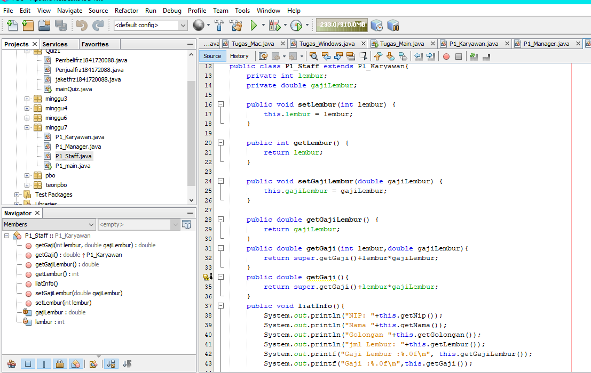
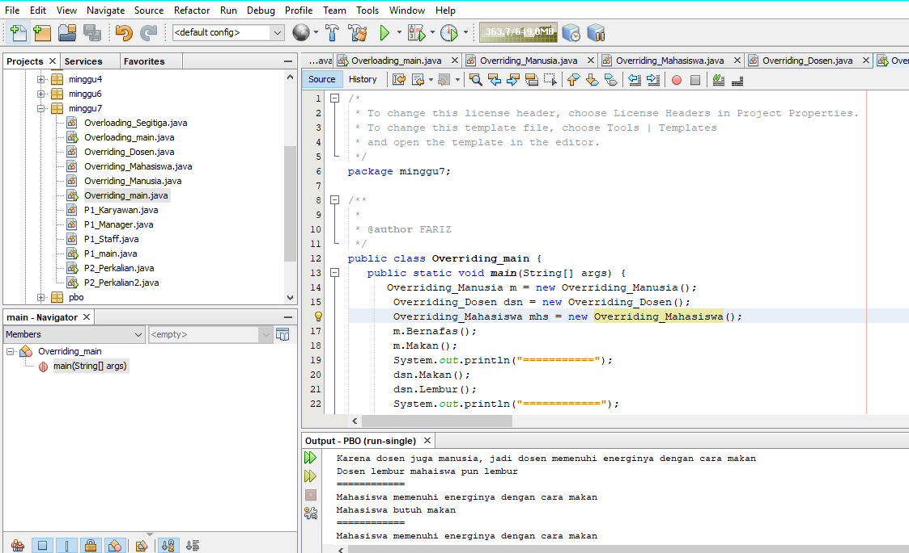

# Laporan Praktikum #7 - OVERLOADING DAN OVERRIDING 

## Kompetensi

Setelah menempuh pokok bahasan ini, mahasiswa mampu : 
1. Memahami konsep overloading dan overriding, 
2. Memahami perbedaan overloading dan overriding, 
3. Ketepatan dalam mengidentifikasi method overriding dan overloading 
4. Ketepatan dalam mempraktekkan instruksi pada jobsheet 
5. Mengimplementasikan method overloading dan overriding.

## Ringkasan Materi
1. Overloading  adalah menuliskan kembali method dengan nama yang sama pada suatu class. Tujuannya dapat memudahkan penggunaan/pemanggilan method dengan fungsionalitas yang mirip. 

    Untuk aturan pendeklarasian method Overloading sebagai berikut: 

     Nama method harus sama. 

     Daftar parameter harus berbeda. 

     Return type boleh sama, juga boleh berbeda. 

2.  Overriding  adalah Sublass yang berusaha memodifkasi tingkah laku yang diwarisi dari superclass. Tujuannya subclass dapat memiliki tingkah laku yang lebih spesifik sehingga dapat dilakukan dengan cara mendeklarasikan kembali method milik parent class di subclass. 

    Deklarasi method pada subclass harus sama dengan yang terdapat di super class. Kesamaan pada: 

     Nama 

     Return type (untuk return type : class A atau merupakan subclass dari class A) 

     Daftar parameter (jumlah, tipe dan urutan) 

## Percobaan

### Percobaan 1 

Untuk kasus contoh berikut ini, terdapat tiga kelas, yaitu Karyawan, Manager, dan Staff. Class Karyawan merupakan superclass dari Manager dan Staff dimana subclass Manager dan Staff memiliki method untuk menghitung gaji yang berbeda. 

### progam pratikum 1

link kode program : [Program 1](../../Src/7_Overriding_dan_Overloading/P1_Karyawan.java)

link kode program : [Program 2](../../Src/7_Overriding_dan_Overloading/P1_Staff.java)

link kode program : [Program 3](../../Src/7_Overriding_dan_Overloading/P1_Manager.java)

link kode program : [Program 4](../../Src/7_Overriding_dan_Overloading/P1_main.java)

#### Latihan 
link kode program : [Program](../../Src/7_Overriding_dan_Overloading/P2_Perkalian.java)

1. Dari source coding diatas terletak dimanakah overloading? 

    Jawab : Overloading memiliki ciri-ciri yaitu nama method sama, daftar parameter (signature) berbeda, dan return type boleh sama, boleh berbeda.

     void perkalian (int a, int b){
        System.out.println(a*b);
    }
   
    void perkalian(int a, int b, int c){
        System.out.println(a*b*c);
    }

2. Jika terdapat overloading ada berapa jumlah parameter yang berbeda? 

    Jawab : ada 2 parameter yang berbeda.

3. Dari source coding diatas terletak dimanakah overloading? 

     void perkalian (int a, int b){
        System.out.println(a*b);
    }
    
    void perkalian(int a, int b, int c){
        System.out.println(a*b*c);
    }
 

 
4. Jika terdapat overloading ada berapa tipe parameter yang berbeda?

    Jawab : ada 2 parameter yang berubah

5. Dari source coding diatas terletak dimanakah overriding? 

    Jawab : Overriding memiliki ciri-ciri yaitu terjadi pada class tururnan ( sub class ), nama method sama, signature sama dan return type sama. 

  
 
6. Jabarkanlah apabila sourcoding diatas jika terdapat overriding?

    Jawab : Overriding terjadi jika terdapat method pada sub class dengan nama yang sama dan signatur (susunan parameter) yang sama dengan parent-classnya. Pada source coding di atas Class Piranha yang merupakan sub class dari class ikan. Kemudian pada kedua class tersebut terdapat method dengan nama yang sama, dan method yang di override memiliki akses public.

## Tugas

1. OVERLOADING
    
    

link kode program : [Program tugas](../../Src/7_Overriding_dan_Overloading/Overloading_Segitiga.java)

link kode program : [Program tugas](../../Src/7_Overriding_dan_Overloading/Overloading_main.java)

2. OVERRIDING

link kode program : [Program tugas1](../../Src/7_Overriding_dan_Overloading/Overriding_Manusia.java)

link kode program : [Program tugas2](../../Src/7_Overriding_dan_Overloading/Overriding_Mahasiswa.java)

link kode program : [Program tugas3](../../Src/7_Overriding_dan_Overloading/Overriding_Dosen.java)

link kode program : [Program tugas4](../../Src/7_Overriding_dan_Overloading/Overriding_main.java)

## Kesimpulan

Setelah menempuh pokok bahasan ini, mahasiswa mampu : 
1. Memahami konsep overloading dan overriding, 
2. Memahami perbedaan overloading dan overriding, 
3. Ketepatan dalam mengidentifikasi method overriding dan overloading 
4. Ketepatan dalam mempraktekkan instruksi pada jobsheet 
5. Mengimplementasikan method overloading dan overriding.

## Pernyataan Diri

Saya menyatakan isi tugas, kode program, dan laporan praktikum ini dibuat oleh saya sendiri. Saya tidak melakukan plagiasi, kecurangan, menyalin/menggandakan milik orang lain.

Jika saya melakukan plagiasi, kecurangan, atau melanggar hak kekayaan intelektual, saya siap untuk mendapat sanksi atau hukuman sesuai peraturan perundang-undangan yang berlaku.

Ttd,

***Mochamad Fariz I***
