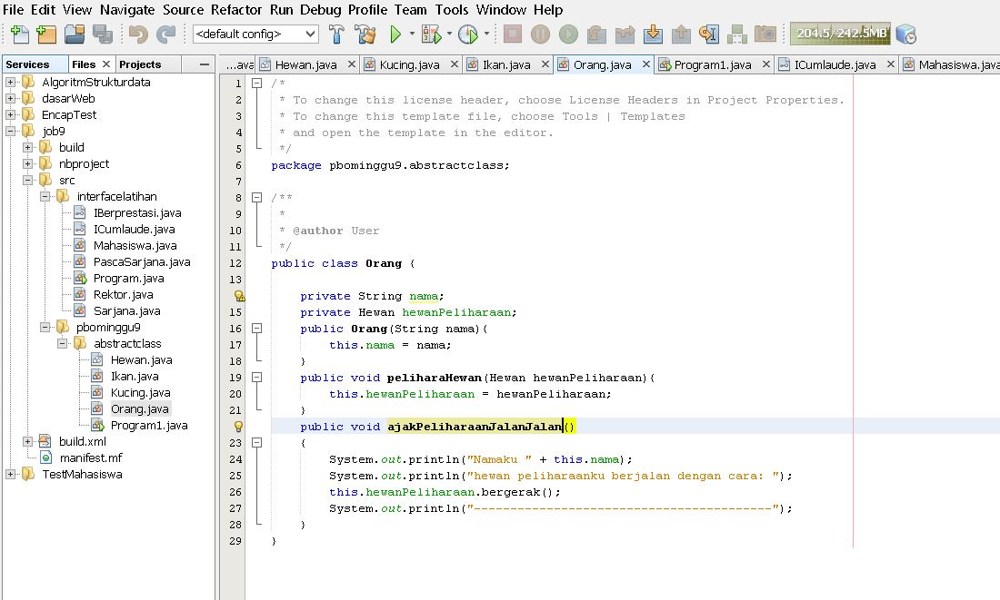

# Laporan Praktikum #9 - Abstract Class dan Interface 

## Kompetensi
Setelah menyelesaikan lembar kerja ini mahasiswa diharapkan mampu: 
1. Menjelaskan maksud dan tujuan penggunaan Abstract Class;
2. Menjelaskan maksud dan tujuan penggunaan Interface; 
3. Menerapkan Abstract Class dan Interface di dalam pembuatan program. 

## Ringkasan Materi

untuk keseluruhan dalam menyelesaikan tugas yang di berikan dosen tidak ada masalah, mulai terbiasa dengan cara pengiriman 

## Praktikum

### Percobaan 1

Class Hewan

Link kode program : 
[Hewan](../../Src/9_Abstract_Class_dan_Interface/Hewan.java)

Class Kucing

Link kode program : 
[Kucing](../../Src/9_Abstract_Class_dan_Interface/Kucing.java)

Class Ikan

Link kode program : 
[Ikan](../../Src/9_Abstract_Class_dan_Interface/Ikan.java)

Class Orang

Link kode program : 
[Orang](../../Src/9_Abstract_Class_dan_Interface/Orang.java)

Class Pt1Program

Link kode program : 
[Program](../../Src/9_Abstract_Class_dan_Interface/Program1.java)

### Percobaan 2
Class ICumlaude

Link kode program : 
[ICumlaude](../../Src/9_Abstract_Class_dan_Interface/ICumlaude.java)

Class Mahasiswa

Link kode program : 
[Mhasiswa](../../Src/9_Abstract_Class_dan_Interface/Mahasiswa.java)

Class Sarjana

Link kode program : 
[Sarjana](../../Src/9_Abstract_Class_dan_Interface/Sarjana.java)

Class PascaSarjana

Link kode program : 
[PascaSarjana](../../Src/9_Abstract_Class_dan_Interface/PascaSarjana.java)

Class Rektor

Link kode program : 
[Rektor](../../Src/9_Abstract_Class_dan_Interface/Rektor.java)

Class Program

Link kode program : 
[Pt2Program](../../Src/9_Abstract_Class_dan_Interface/Program.java)

#### soal
a. Mengapa pada langkah nomor 9 terjadi error? Jelaskan! 

b. Dapatkah method kuliahDiKampus() dipanggil dari objek sarjanaCumlaude di class Program? Mengapa demikian? 

c. Dapatkah method kuliahDiKampus() dipanggil dari parameter mahasiswa di method beriSertifikatCumlaude() pada class Rektor? Mengapa demikian? 

d. Modifikasilah method beriSertifikatCumlaude() pada class Rektor agar hasil eksekusi class Program menjadi seperti berikut ini: 

### Percobaan 3

Class IBerprestasi

Link kode program : 
[IBerprestasi](../../Src/9_Abstract_Class_dan_Interface/IBerprestasi.java)

Class PascaSarjana

Link kode program : 
[Kucing](../../Src/9_Abstract_Class_dan_Interface/PascaSarjana.java)

Class Rektor 

Link kode program : 
[Ikan](../../Src/9_Abstract_Class_dan_Interface/Rektor.java)

Class Pt3Program

Link kode program : 
[Pt3Program](../../Src/9_Abstract_Class_dan_Interface/Program.java)

#### Soal
Apabila Sarjana Berprestasi harus menjuarai kompetisi NASIONAL dan menerbitkan artikel di jurnal NASIONAL, maka modifikasilah class-class yang terkait pada aplikasi Anda agar di class Program objek pakRektor dapat memberikan sertifikat mawapres pada objek sarjanaCumlaude. 

## Kesimpulan

saya mulai mehami abstrak dan implementasi 

## Pernyataan Diri

Saya menyatakan isi tugas, kode program, dan laporan praktikum ini dibuat oleh saya sendiri. Saya tidak melakukan plagiasi, kecurangan, menyalin/menggandakan milik orang lain.

Jika saya melakukan plagiasi, kecurangan, atau melanggar hak kekayaan intelektual, saya siap untuk mendapat sanksi atau hukuman sesuai peraturan perundang-undangan yang berlaku.

Ttd,

***(MOCHAMAD FARIZ)***